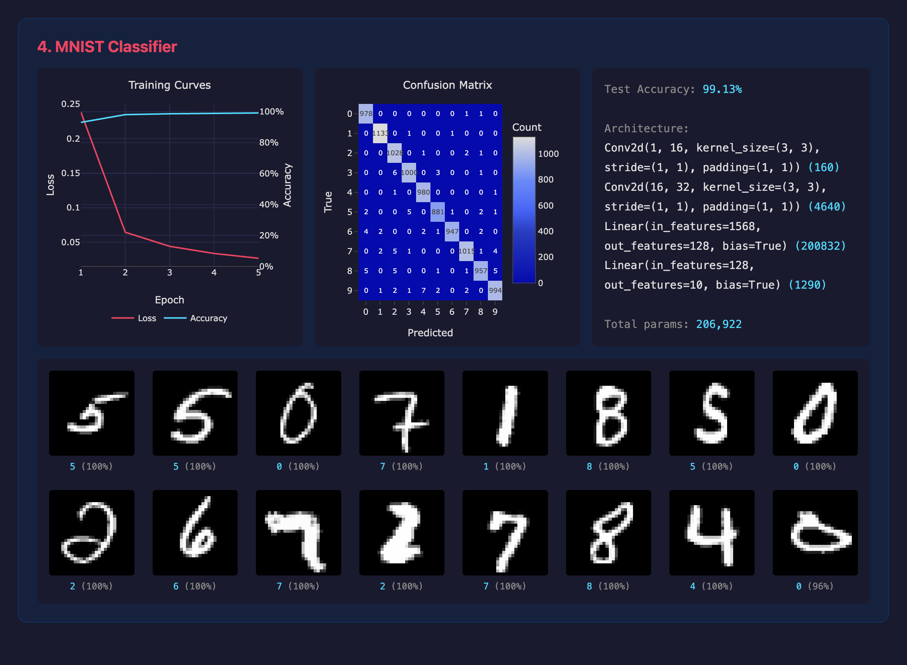

# PyTorch Lab

A collection of hands-on PyTorch exercises exploring core machine learning concepts from scratch, with an interactive web dashboard for visualizing results.

## Dashboard

Run all exercises and launch the interactive dashboard:

```bash
source venv/bin/activate
python run_all.py              # run all labs
python run_all.py 1-linear     # run a single lab
python run_all.py 1-linear 3-mlp  # run specific labs
```

This trains the selected models, writes results to `data/`, starts a local server on port 8000, and opens the dashboard in your browser. The dashboard only shows sections for labs that have data.

### Linear Regression

Fits a simple `y = 2x + 1` relationship using gradient descent. Demonstrates tensor operations, MSE loss, and the basic training loop (forward pass, backpropagation, weight update).


### Logistic Regression

Binary classification on a 2D dataset with two clusters. Uses a sigmoid activation and BCE loss to learn a decision boundary separating the classes.


### Multi-Layer Perceptron (MLP)

Classifies concentric circles — a non-linearly separable problem that a single-layer model can't solve. Uses a 2→16→8→1 network with ReLU hidden activations and sigmoid output, trained with Adam optimizer.


### MNIST Classifier (CNN)

Classifies handwritten digits (0-9) from the MNIST dataset using a convolutional neural network. Introduces `torchvision`, `DataLoader`, convolutional layers, and multi-class classification with 10 output classes. Achieves ~99% test accuracy.



## Setup

```bash
python -m venv venv
source venv/bin/activate
pip install torch torchvision
```

## Usage

Run individual exercises directly:

```bash
python 1_linear_regression.py
python 2_logistic_regression.py
python 3_mlp.py
python 4_mnist.py
```

Or use the runner to select labs and launch the dashboard:

```bash
python run_all.py                      # all labs
python run_all.py 2-logistic 4-mnist   # specific labs
python run_all.py 1-linear --no-server # run without launching dashboard
```

The dashboard is interactive — charts are zoomable and hoverable via Plotly.js.
