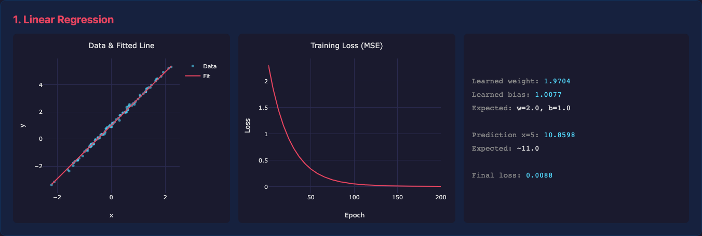
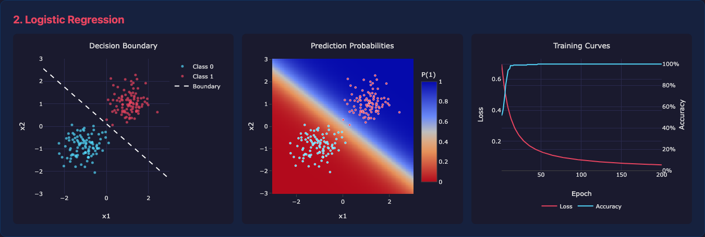
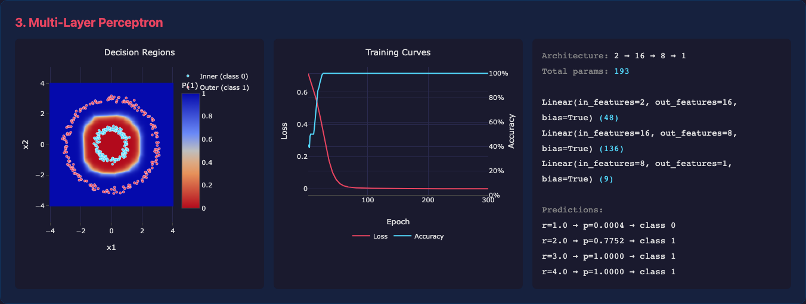

# PyTorch Lab

A collection of hands-on PyTorch exercises exploring core machine learning concepts from scratch, with an interactive web dashboard for visualizing results.

## Dashboard

Run all exercises and launch the interactive dashboard in one command:

```bash
source venv/bin/activate
python run_all.py
```

This trains all three models, writes results to `data/`, starts a local server on port 8000, and opens the dashboard in your browser.

### Linear Regression

Fits a simple `y = 2x + 1` relationship using gradient descent. Demonstrates tensor operations, MSE loss, and the basic training loop (forward pass, backpropagation, weight update).



### Logistic Regression

Binary classification on a 2D dataset with two clusters. Uses a sigmoid activation and BCE loss to learn a decision boundary separating the classes.



### Multi-Layer Perceptron (MLP)

Classifies concentric circles — a non-linearly separable problem that a single-layer model can't solve. Uses a 2→16→8→1 network with ReLU hidden activations and sigmoid output, trained with Adam optimizer.



## Setup

```bash
python -m venv venv
source venv/bin/activate
pip install torch
```

## Usage

Run individual exercises:

```bash
python linear_regression.py
python logistic_regression.py
python mlp.py
```

Or run everything and launch the dashboard:

```bash
python run_all.py
```

The dashboard is interactive — charts are zoomable and hoverable via Plotly.js.
